# Perimeter-Scan Lifecycle — Single TLD mit n Subdomains

**Generiert:** 2026-05-05
**Git-Commit:** `ea8e1a5` (`fix(scan-drift): Snapshot als Seed + Tech-Profile-Anreicherung + finding_type-Persistenz`)
**Quelle:** Ausschließlich Code im o. g. Commit. Spec-Dokumente, Pläne
und nicht implementierte Soll-Zustände sind explizit nicht eingeflossen.

**Live-Messwerte:** Ø-Laufzeiten in den Tool-Tabellen sind aus
`scan_results.duration_ms` über 30 abgeschlossene Perimeter-Orders der
Test-Umgebung (`scan-api.vectigal.tech`, Stand 2026-05-05) aggregiert.
Spalte `n` zeigt die Anzahl der Stichproben (mehrere Werte pro Order
möglich, wenn das Tool pro Host/VHost läuft). `0`-Werte deuten auf
Calls hin, die nicht über den `run_tool`-Wrapper laufen
(Library-Calls, AI-Debug-Einträge ohne Timing) und dadurch keinen
`duration_ms`-Wert in `scan_results` schreiben.

> Dieses Dokument ersetzt inhaltlich `docs/SCAN-PIPELINE-DETAIL.md` und
> `docs/SCAN-TOOLS.md`. Alte Dokumente bleiben als Referenz im Repo.

> Der Subscription-Lauf (Multi-Target-Order über Abo) ist in
> `docs/scan-flow/perimeter-subscription.md` dokumentiert. Phasen 0a–3
> + Reporter sind identisch — dort werden nur die Deltas zum One-Off-Lauf beschrieben.

---

## 0. Eingangsbedingungen

- Eine TLD (z. B. `example.com`) wird als einzelnes Target via
  `POST /api/orders` mit `package: "perimeter"` eingereicht.
  (`api/src/routes/orders.ts:68-161`)
- Customer-User ist authentifiziert (`requireAuth`).
- Der Pre-Check wird angestossen, danach Admin-Review, dann der eigentliche Scan.

---

## 1. Schematische Darstellung (Mermaid)

```mermaid
flowchart TD
    A["POST /api/orders<br/>package=perimeter, targets=example.com<br/>orders.ts:68"] --> B["INSERT orders<br/>status=precheck_running<br/>orders.ts:106"]
    B --> C["INSERT scan_targets<br/>status=pending_precheck<br/>orders.ts:114"]
    C --> D["enqueuePrecheck<br/>queue precheck-pending<br/>queue.ts:32"]

    D --> E["precheck-worker BLPOP<br/>precheck_worker.py:84"]
    E --> F["runner.run_target per Target<br/>runner.py:42"]
    F --> G["FQDN dns_resolver httpx_probe saas_heuristic<br/>runner.py:87"]
    G --> H["INSERT scan_target_hosts<br/>writer.py:42"]
    H --> I["scan_targets.status=precheck_complete<br/>writer.py:50"]
    I --> J{"alle Targets fertig"}
    J -- ja --> K["orders.status=pending_target_review<br/>precheck_worker.py:55"]

    K --> L["Admin reviewt im UI<br/>/admin/review/orderId"]
    L --> M["POST approve target<br/>admin-review.ts:195"]
    M --> N["POST release order<br/>admin-review.ts:299"]
    N --> O["INSERT scan_run_targets<br/>orders.status=queued"]
    O --> P["scanQueue.add scan<br/>queue scan-pending"]

    P --> Q["scan-worker BLPOP<br/>worker.py:975"]
    Q --> R["Phase 0a passive_intel<br/>phase0a.py:24"]
    R --> S["Phase 0b DNS Discovery VHost-Probe<br/>phase0.py:1411"]
    S --> T{"skip_ai_decisions"}
    T -- "nein perimeter" --> U["KI 1 Host-Strategy Haiku<br/>ai_strategy.py:268"]
    U --> V["_enforce_scan_for_live_web_hosts<br/>ai_strategy.py:350"]
    V --> W["Phase 1 Tech-Detection pro VHost<br/>phase1.py:682"]
    W --> X["KI 2 Tech-Analysis Haiku<br/>ai_strategy.py:466"]
    X --> Y["KI 3 Phase-2-Config per Host<br/>ai_strategy.py:609"]
    Y --> Z["Phase 2 Deep-Scan ZAP-Pool<br/>phase2.py:999"]
    Z --> AA["Phase 3 Correlation Threat-Intel<br/>phase3.py:65"]
    AA --> AB{"Findings ab 5 multi-tool CVE"}
    AB -- ja --> AC["KI 4 Cross-Tool-Confidence Sonnet<br/>ai_strategy.py:819"]
    AB -- nein --> AD["Skip-Gate"]
    AC --> AE["FP-Filter Business-Impact"]
    AD --> AE
    AE --> AF["_finalize<br/>worker.py:854"]
    AF --> AG["tar.gz nach MinIO scan-rawdata<br/>upload.py:25"]
    AG --> AH["enqueue report-pending"]

    AH --> AI["report-worker BLPOP<br/>worker.py:665"]
    AI --> AJ["parser.parse_scan_data"]
    AJ --> AK["KI 5 Reporter Opus 4.6<br/>claude_client.py:593"]
    AK --> AL["eol_detector.detect_eol_findings<br/>eol_detector.py:285"]
    AL --> AM["merge_into_claude_findings<br/>eol_detector.py:370"]
    AM --> AN["finding_type_mapper<br/>finding_type_mapper.py:358"]
    AN --> AO["severity_policy.apply_policy 63 Regeln<br/>severity_policy.py:1012"]
    AO --> AP["business_impact.recompute<br/>business_impact.py:182"]
    AP --> AQ["selection.select_findings 15 plus 6<br/>selection.py:210"]
    AQ --> AR["title_policy.apply_titles<br/>title_policy.py:317"]
    AR --> AS["qa_check.run_qa_checks 9 Checks<br/>qa_check.py:631"]
    AS --> AT["report_mapper Compliance-Module<br/>report_mapper.py:1422"]
    AT --> AU["generate_report._validate_toc<br/>generate_report.py:1038"]
    AU --> AV["ReportLab PDF<br/>generate_report.py"]
    AV --> AW["MinIO scan-reports orderId.pdf"]
    AW --> AX["INSERT reports<br/>orders.status=pending_review"]
    AX --> AY["posture_aggregator.aggregate_into_posture<br/>posture_aggregator.py:218"]
```



---

## 2. Chronologischer Ablauf

### 2.1 Order-Anlage (`api/src/routes/orders.ts`)

| Schritt | Code | Beschreibung |
|---|---|---|
| Endpoint | `POST /api/orders` (`orders.ts:68`) | requireAuth, ohne Admin-Pflicht |
| DB-Insert orders | `orders.ts:106` | `status='precheck_running'`, `target_count=n` |
| DB-Insert scan_targets | `orders.ts:114` | pro Target ein Eintrag, `status='pending_precheck'`, `target_type ∈ {fqdn_root, fqdn_specific, ipv4, cidr}`, `discovery_policy ∈ {enumerate, scoped, ip_only}` |
| Job-Enqueue | `orders.ts:149` → `enqueuePrecheck({orderId, targetIds})` (`api/src/lib/queue.ts:32` `client.rPush('precheck-pending', ...)`) |
| WebSocket-Event | `lib/ws-manager.ts:37` `publishEvent` |

### 2.2 Pre-Check (`scan-worker/scanner/precheck_worker.py` + `scanner/precheck/`)

| Schritt | Code | Beschreibung |
|---|---|---|
| Queue-Polling | `precheck_worker.py:84` `client.blpop(['precheck-pending'], timeout=5)` |
| Target laden | `precheck/writer.py:21` `load_target(target_id)` |
| Target-Routing | `precheck/runner.py:42` `run_target(target)` |
| FQDN-Pfad | `runner.py:87` DNS-Resolution + httpx-Probe + Cloud-Provider-Detection |
| IPv4-Pfad | `runner.py:138` Reverse-DNS + nmap Top-10 + httpx + Cloud-Provider |
| Hosts persistieren | `writer.py:42` `INSERT INTO scan_target_hosts` (Spalten: `ip, fqdns, is_live, ports_hint, http_status, http_title, http_final_url, reverse_dns, cloud_provider, parking_page, source`) |
| Target-Status | `writer.py:50` `UPDATE scan_targets SET status='precheck_complete'` |
| Order-Status-Sammelpruefung | `precheck_worker.py:55` Wenn alle Targets fertig: `UPDATE orders SET status='pending_target_review'` |

Tools im Pre-Check (interne Module, keine eigenstaendige CLI-Layer):

| Tool | Aufruf | Parameter | Schema | Ø-Laufzeit | Timeout | Storage | Cache | Parallelitaet | Fehlerbehandlung | Quelle |
|---|---|---|---|---|---|---|---|---|---|---|
| dns_resolver | `dns_resolver.resolve(fqdn)` | FQDN | `{ips: [str], cnames: [str]}` | konfiguriert ~3s | siehe Modul | scan_target_hosts.fqdns/ip | — | sequenziell pro Target | Exception → Target `precheck_failed` | `precheck/runner.py:87` |
| httpx_probe | `httpx_probe.probe(fqdn)` | FQDN | `{status, title, final_url, parking}` | konfiguriert ~5s | Modul | scan_target_hosts.http_* | — | sequenziell | Exception → log + Target weiter | `precheck/runner.py:90` |
| nmap_light | `nmap_light.scan([ip])` | IP-Liste | `{ports: [int]}` | konfiguriert (Top-10) | Modul | scan_target_hosts.ports_hint | — | sequenziell | Exception → log | `precheck/runner.py:138` |
| saas_heuristic | `saas_heuristic.detect_cloud_provider(ip)` | IP | `str | None` | sub-second | — | scan_target_hosts.cloud_provider | — | sequenziell | Exception → cloud_provider=NULL | `precheck/runner.py:95` |

### 2.3 Admin-Review (`api/src/routes/admin-review.ts`)

| Schritt | Code | Beschreibung |
|---|---|---|
| Queue-Listing | `admin-review.ts:29` `GET /api/admin/review/queue` |
| Detail | `admin-review.ts:87` `GET /api/admin/review/:type/:id` |
| Approve | `admin-review.ts:195` `POST /api/admin/targets/:id/approve` (`UPDATE scan_targets SET status='approved', approved_by, approved_at`) |
| Reject | `admin-review.ts:257` `POST /api/admin/targets/:id/reject` |
| Authorization-PDF | `admin-review.ts:379` Upload nach MinIO-Bucket `scan-authorizations`, Pfad `<orderId>/<uuid>-<filename>` (`putObject`), `INSERT INTO scan_authorizations` |
| **Release** | `admin-review.ts:299` `POST /api/admin/orders/:id/release` |
| Release-Logik | pro approved Target: `INSERT INTO scan_run_targets (order_id, scan_target_id, in_scope=true, snapshot_discovery_policy, snapshot_exclusions)`; Order → `status='queued'` |
| Scan-Enqueue | `admin-review.ts:369` `scanQueue.add('scan', { orderId, package })` (`api/src/lib/queue.ts:14` `client.rPush('scan-pending', ...)`) |

### 2.4 Scan-Worker — Entry-Point

| Schritt | Code | Beschreibung |
|---|---|---|
| Entry-File | `scan-worker/scanner/__main__.py:2` → `scanner.worker.main` |
| Worker-Start | `worker.py:1027` `def main()` |
| Queue-Polling | `worker.py:975` `redis_client.blpop(['scan-pending', 'diagnose-pending'], timeout=5)` |
| Job-Felder | `worker.py:993` erwartet `orderId`, `targetDomain` (oder None bei Multi-Target), `package` |
| Routing | `worker.py:1000` `_process_job` (Single-Domain) oder `_process_job_multi_target` |
| Status-Updates | `worker.py:223` `set_scan_started`, `worker.py:281` `set_discovered_hosts`, `worker.py:166` `set_scan_failed`, `worker.py:897` `set_scan_complete` |

`docker-compose.yml` startet **drei** scan-worker-Container (`scan-worker-1`,
`scan-worker-2`, `scan-worker-3`) plus **vier** ZAP-Daemons (`zap-1` … `zap-4`)
und **zwei** precheck-worker-Container.

### 2.5 Phase 0a — Passive Intel (`scan-worker/scanner/phase0a.py`)

Aktivierung: `worker.py:237` (`run_phase0a` mit `phase0a_tools` aus
`packages.py:_PERIMETER_BASE`). Default-Timeout: `phase0a_timeout=120s`
(`packages.py`). Parallelisierung: ThreadPoolExecutor `max_workers=5`
(`phase0a.py:127`). Bei Fehler: `as_completed` mit Timeout, Exceptions geloggt,
Tool fehlt im Result-Dict.

Persistenz: `_save_passive_intel_summary` schreibt
`orders.passive_intel_summary` (JSONB) (`worker.py:253`). Re-Run nach
Phase 0b mit erweiterten IPs: `worker.py:304-314`.

| Tool | Aufruf | Parameter | Erwartetes Schema | Ø-Laufzeit | Timeout | Storage | Cache | Parallelitaet | Fehlerbehandlung | Quelle |
|---|---|---|---|---|---|---|---|---|---|---|
| WHOIS | `WhoisClient().lookup(domain)` | Domain | `{registrar, creation, expiration, name_servers, dnssec, country}` | gemessen — (Library-Call, kein run_tool-Timing) | 30s | `passive_intel_summary.whois` | — | ThreadPool | Exception → `None` | `phase0a.py:62`, `passive/whois_client.py` |
| Shodan | `ShodanClient.lookup_domain(d)` + `lookup_host(ip)` über Top-15 IPs | API-Key `SHODAN_API_KEY`, max 15 IPs | `{ports[], services[], os, tags}` | gemessen — | 10s/Req | `phase0a/shodan_*.json` + `passive_intel_summary.shodan` | — | ThreadPool | HTTP 429 → exponential Backoff (2^attempt × 2s, max 30s) | `phase0a.py:70`, `passive/shodan_client.py` |
| AbuseIPDB | `AbuseIPDBClient.check_ip(ip)` Top-15 IPs | `ABUSEIPDB_API_KEY`, `maxAgeInDays=90`, `verbose=true` | `{abuseConfidenceScore, totalReports, isTor, country, isp}` | gemessen — | 10s/Req | `phase0a/abuseipdb.json` | — | ThreadPool | Exception geloggt | `phase0a.py:91`, `passive/abuseipdb_client.py` |
| SecurityTrails | `ST.lookup_domain` + `get_subdomains` + `get_dns_history` | `SECURITYTRAILS_API_KEY` Header `apikey` | `{records, subdomains, history}` | **gemessen Ø ≈ 15.0 s** (med 14.7 s, max 18.7 s, n=15) | 10s/Req | `phase0a/securitytrails.json` | — | ThreadPool | Exception geloggt | `phase0a.py:106`, `passive/securitytrails_client.py` |
| DNS-Security | `run_all_dns_security(domain, package)` | Domain + Paket | `{dnssec, caa, mta_sts, dane}` | gemessen — | siehe Modul | `phase0a/dns_security.json` | — | ThreadPool | Exception geloggt | `phase0a.py:120`, `passive/dns_security.py` |

### 2.6 Phase 0b — DNS + Discovery + Probe + Scope (`scanner/phase0.py`)

Einstieg: `phase0.py:1411` `run_phase0(domain, scan_dir, order_id, config)`.
Ergebnis: `host_inventory` mit `hosts[].vhosts[]`, `dns_findings`,
`discovery_health`. Persistenz: `worker.py:281`
`set_discovered_hosts(order_id, host_inventory)` schreibt
`orders.discovered_hosts` (JSONB).

| Tool | Aufruf | Parameter | Schema | Ø-Laufzeit | Timeout | Storage | Cache | Parallelitaet | Fehlerbehandlung | Quelle |
|---|---|---|---|---|---|---|---|---|---|---|
| crt.sh | HTTP `crt.sh/?q=&output=json` über `run_crtsh()` | Domain | List of CT-Entries | **gemessen Ø 6.6 s** (med 0.5 s, max 57 s, n=30); Retry2 Ø 14.7 s (n=10), Retry3 Ø 15.0 s (n=8) | 60s | `phase0/crtsh_raw.json`, `crtsh.json` | — | sequenziell | 3-Stufen-Self-Retry (5/15/30s) → leer → certspotter-Fallback | `phase0.py:120` |
| certspotter | HTTP `api.certspotter.com` (Fallback) | Domain | List | **gemessen Ø 0.55 s** (med 0.44 s, max 1.25 s, n=7) | konfiguriert | `phase0/certspotter.json` | — | sequenziell | Exception → leer | `phase0.py:` |
| subfinder | CLI `subfinder -d <domain>` via `tools.run_tool` | Domain | Newline FQDNs | **gemessen Ø 3.1 s** (med 0.35 s, max 15.4 s, n=30) | `phase0b_timeout=900s` (perimeter) | `phase0/subfinder.json` | — | parallel zu amass | Exception → leer | `phase0.py:` |
| amass | CLI `amass enum -d <domain>` | Domain | FQDNs | **gemessen Ø 22.1 s** (med 5.0 s, max 300.0 s = Hard-Cap, n=30); `amass_subs` Ø 45 ms (n=13) | s.o. | `phase0/amass.json` | — | parallel zu subfinder | Exit 0 mit 0 Bytes wird als "leer" toleriert (siehe `docs/analyse/AMASS-V5-DIAGNOSE.md`) | `phase0.py:` |
| gobuster_dns | CLI `gobuster dns -d <domain> -w <wordlist>` (perimeter only) | Domain + Wordlist | Newline FQDNs | **gemessen Ø 1.7 s** (med 0.7 s, max 7.7 s, n=30) | konfiguriert | `phase0/gobuster.json` | — | parallel | Exit !=0 → log + leer | `phase0.py:` |
| dns_records | dig-basierte SPF/DMARC/DKIM/MX/NS-Prüfung | Domain | dict | **gemessen Ø 1 ms** (med 1 ms, max 4 ms, n=30) — fast volstaendig im Cache/lokalen Resolver | n/a | `phase0/dns_records.json` | — | batch | leeres Result toleriert | `phase0.py:` |
| dnsx | CLI `dnsx -a -aaaa -cname -mx -ns -txt -resp -json -r resolvers.txt -rl 100 -retry 2` | Subdomain-Liste | NDJSON | **gemessen Ø 0.51 s** (med 0.37 s, max 2.5 s, n=30) | 60s | `phase0/dnsx_validation.json`, `dns_records.json` | — | batch | Exit !=0 → log + leer | `phase0.py:599` |
| httpx (Multi-VHost-Probe) | CLI `httpx -u <fqdn> -json -silent -follow-redirects -status-code -title -timeout 5` | FQDN-Liste | NDJSON | siehe Phase 1 (gleiche Aggregation; `web_probe` 0 ms = Library-Call) | 5s/Probe | `phase0/httpx_probe/*.json` | — | parallel über FQDNs | Exception → has_web=false | `phase0.py:` |
| Subdomain-Snapshot | `precheck/snapshot_store.find_fresh_for_domain(domain)` | Domain | `{all_subdomains[], tool_sources, fresh}` | sub-second (DB-Lookup) | — | DB `scan_target_subdomain_snapshots` | TTL `SUBDOMAIN_SNAPSHOT_TTL_HOURS=24h` (ENV) | sequenziell | Cache-Miss → frische Discovery → `save_for_target()` | `precheck/snapshot_store.py:43` |

Nach den externen Tools laufen interne Funktionen:

- **`merge_and_group()`** (`phase0.py`) — FQDN→IP-Aggregation, CDN-Edge-Dedup
  (Cloudflare/CloudFront/Fastly/Azure/Vercel), Socket-Fallback für
  Dangling-CNAMEs (5s pro FQDN), Host-Priorisierung 0/1/2/3, Limit-Enforcement
  per `subscriptions.max_hosts` oder Order-Default.
- **`_canonicalize_vhosts(host, scope_root)`** (`phase0.py:1152`) — pro IP
  alle FQDNs auf Body-Hash + Final-URL probieren, Klassifikation
  `primary | alias-redirect | alias-bodydup | skip-extern`. Ergebnis: kanonische
  Liste in `host["vhosts"]` (`phase0.py:1259`).
- **`scope.enforce_scope(host_inventory, targets)`** (`worker.py:271`) — entfernt
  Hosts ausserhalb der approved scan_targets.

### 2.7 KI #1 — Host-Strategy

| Eigenschaft | Wert | Quelle |
|---|---|---|
| Position | nach Phase 0b, vor Phase 1 | `worker.py:371` `plan_host_strategy(...)` |
| Trigger | nicht `skip_ai_decisions=True` (im perimeter-Paket immer aktiv, da `packages.py:_PERIMETER_BASE` kein `skip_ai_decisions`) | `worker.py:350-371` |
| Modell | `claude-haiku-4-5-20251001` | `ai_strategy.py:27` |
| Temperature | 0.0 | `ai_strategy.py:` (`_call_haiku`) |
| max_tokens | 8192 | `ai_strategy.py:` (`_call_haiku`) |
| top_p | nicht gesetzt (default) | — |
| System-Prompt | `HOST_STRATEGY_SYSTEM` | `ai_strategy.py:186-248` (vollständig unten) |
| User-Prompt-Aufbau | Domain + Paket + Hosts-JSON (ip, fqdns, vhosts, web_probe, ports, passive_intel) + DNS-Findings | `ai_strategy.py:281-292` |
| Input-Form | Roh-JSON via `json.dumps(enriched_inventory, indent=2)` | `worker.py:359-371` reichert um Shodan/AbuseIPDB/DNSSEC/WHOIS an |
| Truncation | keine — 8192 Output reicht; Input ist host_inventory-groesse | — |
| Output-Schema | `HOST_STRATEGY_SCHEMA` | `ai_strategy.py:250-265` |
| Output-Parsing | `_strip_markdown_fences(raw)` + `json.loads`; bei JSONDecodeError: `{"_error": ..., "_raw": raw}` | `ai_strategy.py:168-176` |
| Cache-Modus | 3-stufig: `content_hash` > `order_scope` > `input_hash` | `scanner/ai_cache.py:124-147` |
| Cache-Namespace | `ki1_host_strategy` | `ai_strategy.py` |
| Cache-TTL | `7 * 24 * 3600s` = 7 Tage | `ai_strategy.py:31` (`CACHE_TTL_HOST_STRATEGY`) |
| Hard-Override | `_enforce_scan_for_live_web_hosts(result, hosts, domain)` | `ai_strategy.py:337` Aufruf, `:350` Definition |
| Persistenz | `scan_dir/phase0/host_strategy.json` + `scan_results.tool_name='ai_host_strategy_debug'` (raw + cost) | `worker.py:373-...` |
| Cost-Persist | `ai_call_costs` via `ai_cost_persist._persist_cost(order_id, namespace, model, stats, duration_ms)` | `ai_strategy.py:178` |

System-Prompt (vollständig, `ai_strategy.py:186-248`):

```text
Du bist ein Security-Scanner-Orchestrator. Du entscheidest, welche Hosts gescannt werden und mit welcher Priorität.

WICHTIG ZU FQDNs:
- Jeder Host hat eine Liste von FQDNs die auf dieselbe IP zeigen
- Die ERSTE FQDN in der Liste ist die relevanteste (Basisdomain vor www vor Subdomains)
- Wenn ein Host sowohl die Basisdomain als auch Mail-FQDNs enthält, ist er IMMER ein Web-Host
- Beurteile den Host nach seiner wichtigsten FQDN, nicht nach Mail-Subdomains

WEB-PROBE DATEN:
- Jeder Host kann ein "web_probe" Feld haben mit has_web, status, final_url, title
- has_web=true: HTTP-Content vorhanden → Web-Scan (alle Tools)
- has_web=false: Kein HTTP-Content → Port-Scan (nmap + testssl reichen)
- final_url zeigt wohin Redirects führen → die relevante Scan-URL

PASSIVE INTELLIGENCE (wenn verfügbar):
- Jeder Host kann ein "passive_intel" Feld haben mit Daten aus Shodan, AbuseIPDB, WHOIS:
  - shodan_ports: Bereits bekannte offene Ports pro IP
  - shodan_services: Service-Versionen (z.B. {"443": "nginx 1.18", "22": "OpenSSH 7.9"})
  - abuseipdb_score: IP-Reputation (0-100, höher = verdächtiger)
  - is_tor: Ob die IP ein Tor-Exit-Node ist
  - dnssec_signed: Ob die Domain DNSSEC-signiert ist
  - whois_expiration: Domain-Ablaufdatum

ERWEITERTE REGELN (Passive Intel):
- Hosts mit veralteten Service-Versionen aus Shodan (alte OpenSSH, alte nginx) → Priorität 1
- Hosts mit exponierten Management-Ports (22, 3389, 5900, 8080, 8443) aus Shodan → Priorität 1
- Hosts mit hohem AbuseIPDB-Score (>50) → Priorität 1 (mögliche Kompromittierung)
- Hosts mit nur Port 80/443 und niedrigem AbuseIPDB-Score → Priorität 2
- Mailserver mit fehlender SPF/DMARC → scannen (nicht skippen!)

STANDARD-REGELN:
- Basisdomain und www-Subdomain: IMMER scannen (action: "scan"), höchste Priorität
- Webserver mit interaktivem Content (Apps, APIs, CMS, Shops): scan (hohe Priorität)
- Mailserver (MX, SMTP, IMAP): scan mit NIEDRIGERER Priorität — NICHT skippen!
- Autodiscover-Hosts (nur Exchange/Outlook-Konfiguration): skip
- Parking-Pages, Redirect auf externe Domain: skip
- CDN-Edge-Nodes (nur CDN-IP, kein eigener Content): skip (außer bei has_web=true mit eigenem Content)
- Wenn unklar: lieber scannen als überspringen

VHOST-MODELL (Multi-VHost-Probe seit Mai 2026):
- Jeder Host hat ein Feld `vhosts: [{fqdn, status, title, final_url, aliases}]`
  mit ALLEN echten Web-Anwendungen (primary VHosts) auf der IP.
- Du entscheidest action/priority pro **Host (= IP)**, nicht pro VHost.
  Ein Scan-Lauf deckt automatisch alle primary VHosts der IP ab.
- Skip-Begründung muss explizit ALLE primary VHosts als irrelevant einstufen.
  Beispiel: IP mit vhosts=[ose.heuel.com (200, Login), edi.heuel.com (403)]
  → scan, weil mindestens ose.heuel.com echten Content liefert.
- Aliase (FQDNs die per Redirect oder Body-Hash auf einen primary zeigen) sind
  schon dedupliziert — nicht doppelt zählen.
- vhost_skipped[] zeigt FQDNs die als Parking/Extern-Redirect ausgeschlossen wurden.

KRITISCHE NICHT-SKIPP-REGELN (werden notfalls automatisch erzwungen):
- Mindestens 1 primary VHost mit status in [200,201,204,301,302,401,403,405]: NIEMALS skip
  → Auch ein generischer Title wie "Redirector", "Welcome", "Default Page" ist KEIN Skip-Grund.
- Cloudflare/WAF-403 ("Just a moment...", cf-ray-Header): scan mit niedriger Priorität (3),
  NICHT skip — der Customer-Service liegt dahinter.
- Nur dann skip wenn vhosts leer ist ODER alle vhosts auf externe out-of-scope Domains
  redirecten (vhost_skipped[] zeigt das).

Jeder Host braucht eine kurze Begründung (1 Satz).
Priority: 1 = höchste Priorität, aufsteigend.

Antworte NUR mit validem JSON, kein anderer Text.
```

User-Prompt (`ai_strategy.py:281-292`, gekuerzt):

```text
Domain: <domain>
Paket: <package>

Hosts:
<json.dumps(enriched_hosts, indent=2)>

DNS-Findings:
<json.dumps(dns_findings, indent=2)>

Antwort im Format:
<HOST_STRATEGY_SCHEMA>
```

Hard-Override-Regel `_enforce_scan_for_live_web_hosts`
(`ai_strategy.py:350-425`): wenn die KI einen Host auf `skip` setzt, aber
mindestens ein primary VHost `status ∈ {200,201,204,301,302,401,403,405}`
liefert, wird `action="scan"` mit `priority=3` und Begründung
`[AUTO-OVERRIDE] Live-Web-Content` erzwungen.

### 2.8 Phase 1 — Tech-Detection (`scanner/phase1.py`)

| Eigenschaft | Wert | Quelle |
|---|---|---|
| Einstieg | `phase1.py:682` `run_phase1(scan_hosts, scan_dir, ...)` |
| Parallelisierung Hosts | ThreadPool, `PHASE1_MAX_WORKERS=3` | `phase1.py` |
| Iteration pro Host | `vhost_iter.iter_primary_vhosts(host, cap=MAX_VHOSTS_PER_HOST)` (Default 5) | `vhost_iter.py:17,20` |
| Tech-Profile-Normalisierung | `_extract_all_tech_signals(redirect_data)` (Splittet Versions-Endungen, dedupliziert auf Namen) | `phase1.py:138-150` |

Tools (Reihenfolge in `run_phase1`):

| Tool | Aufruf | Parameter | Schema | Ø-Laufzeit | Timeout | Storage | Cache | Parallelitaet | Fehlerbehandlung | Quelle |
|---|---|---|---|---|---|---|---|---|---|---|
| nmap | CLI `nmap --top-ports 1000 --script=ssl-cert -oX <out>` (perimeter) | Top-1000-Ports + SSL-Cert | XML | **gemessen Ø 45.5 s** (med 34.2 s, max 189.8 s, n=91 — d. h. ø ~3 Hosts/Order) | 600s pro Host | `scan_dir/hosts/<ip>/phase1/nmap.xml`, `scan_results` | — | parallel über 3 Hosts; 1× pro IP (nicht pro VHost) | Exit !=0 → log + leer | `phase1.py`, `scanner/tools/__init__.py` |
| httpx | CLI `httpx -silent -no-color -json` pro VHost | URL-Liste | NDJSON | **gemessen Ø 2.1 s** (med 0.83 s, max 20.6 s, n=105) | konfiguriert | `phase1/httpx.json` | — | parallel | Exit !=0 → log | `phase1.py` |
| webtech (Playwright + Wappalyzer-Lite) | Python-API | URL | `{cookies, scripts, meta, body_classes}` | gemessen — (Library-Call, kein run_tool-Timing) | konfiguriert | redirect_data im host-Dict | — | sequenziell pro VHost | Exception → log | `phase1.py:138-150` |
| cms_fingerprinter | `CMSFingerprinter.detect()` — max 20 HTTP-Reqs, Early-Exit ab Konfidenz 0.70; 5 Methoden (webtech, meta-tag, probe-matrix, cookie, response-headers); Probe-Matrix per Default OFF (`CMS_PROBE_MATRIX_ENABLED`) | URL | `{cms, cms_version, cms_confidence, cms_details}` | gemessen — (Library-Call) | 5s/Probe | `phase1/cms_fingerprint.json` | — | sequenziell | Exception → log | `scanner/cms_fingerprinter.py` |
| wafw00f | CLI `wafw00f <fqdn> -o <out> -f json` | FQDN | JSON-Array | **gemessen Ø 4.0 s** (med 1.1 s, max 57.8 s, n=105) | 60s | `phase1/wafw00f.json` | — | sequenziell | leeres Result toleriert | `phase1.py` |
| gowitness | CLI `gowitness single -u <url> -o <screenshots/>` | URL | PNG | gemessen — | 60s | `scan_dir/hosts/<ip>/phase1/screenshot_*.png` | — | sequenziell | Exception → log | `phase1.py` |

Output-Persistenz: `scan_results`-Tabelle pro Tool mit
`tool_name, raw_output (max 50KB), exit_code, phase=1, host_ip` (`scanner/tools/__init__.py:run_tool`).

### 2.9 KI #2 — Tech-Analysis (CMS-Korrektur)

| Eigenschaft | Wert | Quelle |
|---|---|---|
| Position | nach Phase 1, vor KI #3 | `worker.py:` Aufruf von `plan_tech_analysis(tech_profiles, redirect_data, order_id)` |
| Trigger | `tech_profiles` nicht leer | `ai_strategy.py:481` |
| Skip-Bedingung | `skip_ai_decisions=True` im Paket | `worker.py:504` |
| Modell | `claude-haiku-4-5-20251001` |
| Temperature / max_tokens | 0.0 / 8192 |
| System-Prompt | `TECH_ANALYSIS_SYSTEM` | `ai_strategy.py:432-450` |
| User-Prompt | tech_profiles_summary + Playwright redirect_data | `ai_strategy.py:496-504` |
| Input-Form | gefilterter Auszug pro Profile (ip, fqdns, cms, cms_confidence, server, open_ports) | `ai_strategy.py:484-494` |
| Output-Schema | `TECH_ANALYSIS_SCHEMA` | `ai_strategy.py:452-463` |
| Output-Parsing | wie KI #1 (`_strip_markdown_fences` + `json.loads`) | `_call_haiku` |
| Cache-Namespace | `ki2_tech_analysis`, TTL 30 d | `ai_strategy.py` (`CACHE_TTL_TECH_ANALYSIS`) |
| Persistenz | `scan_results.tool_name='ai_tech_analysis_debug'` + `ai_call_costs` |

System-Prompt (`ai_strategy.py:432-450`):

```text
Du bist ein Web-Technologie-Analyst. Du bestimmst die korrekte Technologie für jeden Host basierend auf Redirect-Verhalten, HTTP-Headern und Scan-Ergebnissen.

REGELN:
- Wenn eine FQDN auf eine ANDERE Domain redirected → die FQDN nutzt NICHT das CMS dieser anderen Domain
- Wenn /wp-login.php existiert aber Body "nicht gefunden", "not found" oder "404" enthält → KEIN WordPress
- Wenn /wp-login.php auf eine andere Domain redirected → KEIN WordPress auf DIESER Domain
- Page Title "Outlook Web App" oder "OWA" → Microsoft Exchange, KEIN WordPress/CMS
- Page Title mit "TYPO3" oder "Neos" → TYPO3
- meta generator Tag hat Vorrang vor Pfad-Probes
- IIS Server + .aspx/.asmx Pfade → Microsoft-Stack, KEIN PHP-CMS
- Wenn CMS-Fingerprinter WordPress mit hoher Konfidenz (>0.8) meldet UND /wp-login.php tatsächlich WordPress-Login zeigt → WordPress bestätigt
- Wenn CMS-Fingerprinter WordPress meldet ABER /wp-login.php zeigt Fehlerseite → WordPress NICHT bestätigt, CMS auf null setzen

WICHTIG:
- Nur CMS melden wenn du sicher bist. Im Zweifel: cms=null
- technology_stack ist eine Liste aller erkannten Technologien (Server, Sprache, Framework)
- is_spa=true nur wenn React, Vue, Angular, Next.js, Nuxt oder Shopware 6 erkannt

Antworte NUR mit validem JSON, kein anderer Text.
```

### 2.10 KI #3 — Phase-2-Config (per Host)

| Eigenschaft | Wert | Quelle |
|---|---|---|
| Position | nach KI #2, vor Phase 2; pro Host getrennt | `ai_strategy.py:609` |
| Pre-Gate | Rule-Engine `try_rule_based_config()` zuerst — bei eindeutigem Match (WordPress+kein-WAF / CF-WAF / SPA / API-only / Mailserver) entfaellt der KI-Call | `scanner/phase2_config_rules.py:24` |
| Skip | `skip_ai_decisions=True` (TLSCompliance) | `worker.py:505` |
| Modell | `claude-haiku-4-5-20251001` |
| Temperature / max_tokens | 0.0 / 8192 |
| System-Prompt | `PHASE2_CONFIG_SYSTEM` | `ai_strategy.py:540-593` |
| User-Prompt | enriched tech_profile (mit CMS-Details + Shodan-Services) + Paket + Domain | `ai_strategy.py` |
| Output-Schema | `PHASE2_CONFIG_SCHEMA` | `ai_strategy.py:595-606` |
| Cache-Namespace | `ki3_phase2_config`, TTL `7 * 24 * 3600s`, `host_scope=ip` (per-Host) | `ai_strategy.py` |
| Persistenz | bei Rule-Match: `scan_results.tool_name='ai_phase2_config_rule_based'`, sonst `'ai_phase2_config'` |

### 2.11 Phase 2 — Deep-Scan (`scanner/phase2.py`)

| Eigenschaft | Wert | Quelle |
|---|---|---|
| Einstieg | `phase2.py:999` `run_phase2(...)` |
| Parallelisierung Hosts | `min(zap_pool_max, 5 Hosts)` wenn ZAP-Pool aktiv, sonst 1 (Legacy ZAP-Singleton) | `worker.py:606` |
| Iteration pro Host | Web-Tools laufen pro primary VHost (`vhost_iter`); testssl/nmap 1× pro IP | `phase2.py` |
| WAF-Safe-Pfad | `should_parallelize_stage2(host, config)` — wenn `PHASE2_STAGE2_WAF_SAFE=true` (Default) UND (WAF detected ODER `zap_scan_policy=waf-safe`) → Stage 2 sequenziell | `phase2.py:45` |
| ZAP-Pool | Redis-Heartbeat-Lease, Pool aus ENV `ZAP_POOL` (Default `zap-1,zap-2,zap-3,zap-4`); Lease-TTL 900s, Heartbeat 60s; Lua atomic Acquire/Release; max_parallel_per_order = pool_size − 1 | `scanner/zap_pool.py:30-83` |

Tools (Stage 1 + 2 + 3):

| Tool | Aufruf | Parameter | Schema | Ø-Laufzeit | Timeout | Storage | Cache | Parallelitaet | Fehlerbehandlung | Quelle |
|---|---|---|---|---|---|---|---|---|---|---|
| testssl.sh | CLI `testssl --jsonfile <out>` (perimeter ohne `--fast`; webcheck mit `--fast`) | URL/IP | JSON | gemessen — (kein duration_ms in scan_results-Stichprobe; Library-/Wrapper-Call ohne Timing) | 300s | `scan_dir/hosts/<ip>/phase2/testssl.json` | — | Stage 1 parallel | Timeout → SIGKILL Prozessgruppe, partial output gelesen | `phase2.py`, `scanner/tools/__init__.py` |
| nikto | CLI `nikto -h <url> -Format json -o <out>` | URL | JSON | gemessen — | 1800s | `phase2/nikto.json` | — | Stage 1 | dito | `phase2.py` |
| HTTP-Headers (`header_check`) | `curl -sI <url>` Wrapper | URL | dict | gemessen — (sub-second, ohne Timing erfasst, n=105) | 10s | `phase2/headers.json` | — | Stage 1 | leeres Result | `phase2.py` |
| httpx (Phase 2) | CLI wie Phase 1 | URL-Liste | NDJSON | **gemessen Ø 2.1 s** (med 0.83 s, max 20.6 s, n=105) — gleiche Aggregation wie Phase 1 | konfiguriert | `phase2/httpx.json` | — | Stage 1 parallel | Exit !=0 → log | `phase2.py` |
| ZAP Spider + AJAX-Spider + Active-Scan | REST-Calls gegen geleasten ZAP-Daemon (`zap_client.py`); Custom Scan-Policy pro Order (`policy-{order_id[:8]}-{ip}`) | URL, ZAP-Policy, AJAX-Flag, Categories | ZAP-Alerts JSON | **gemessen `zap_active` Ø 105.2 s** (med 10.2 s, max 390.3 s, n=4); `zap`/`zap_spider` 0 ms (Library-Call ohne Timing); Stichprobe klein, weil `zap_active` nur bei zap_scan_policy != passive-only läuft | Spider 120–180s, AJAX 240s, Active 600s | `phase2/zap_alerts.json` | — | Stage 2; via Pool | Lease-Verlust → Retry mit neuem Daemon | `scanner/tools/zap_client.py`, `zap_pool.py` |
| ffuf (Sensitive-Mode `ffuf_sensitive`) | CLI `ffuf -u <url>/FUZZ -w <wordlist> -e .php,.html,.js,.bak -mc 200,301,302,403 -fc 404 -t 40 -rate 100 -timeout 5 -json -o <out> -s` (Modus 1) | URL + Wordlist | NDJSON | **gemessen Ø 173.3 s** (med 171.4 s, max 180.1 s, n=74) — sehr nah am 180s-Timeout | 180s | `phase2/ffuf.json` | — | Stage 2 parallel (sonst seq) | Timeout-tolerant | `phase2.py` |
| ffuf (Parameter-Discovery `ffuf_param`) | CLI `ffuf -u <url>?FUZZ=test -w <wordlist> ...` (Modus 3) | URL + Wordlist | NDJSON | **gemessen Ø 143.2 s** (med 150.2 s, max 180.1 s, n=23) | 180s | `phase2/ffuf_param.json` | — | Stage 2 | Timeout-tolerant | `phase2.py` |
| feroxbuster | CLI `feroxbuster -u <url> -w <wordlist> -d <depth> -t 30 --rate-limit 100 -s 200,301,302,403 --json -o <out> --dont-scan logout|signout|delete --timeout 5 --no-recursion --silent` | URL + Wordlist | NDJSON | **gemessen Ø 69.9 s** (med 5.0 s, max 240.1 s, n=63) — bimodal: oft schnell durch Skip-Heuristiken, sonst nahe Timeout | 150s | `phase2/feroxbuster.json` | — | Stage 2 | Dedup gegen ffuf | `phase2.py` |
| wpscan | CLI `wpscan --url <url> --format json --output <out> --enumerate vp,vt,u1-5 --random-user-agent --no-banner --disable-tls-checks` | URL (+ optional `WPSCAN_API_TOKEN`) | JSON | **gemessen Ø 30.8 s** (med 35.2 s, max 56.0 s, n=14) — läuft nur bei CMS=WordPress | 600s | `phase2/wpscan.json` | — | Stage 2; nur wenn CMS=WordPress | Exception → log | `phase2.py` |
| dalfox | CLI `dalfox url <url> --format json -o <out>` | URL | JSON | gemessen — | konfiguriert | `phase2/dalfox.json` | — | Stage 2 | log + leer | `phase2.py` |
| katana | CLI `katana -u <url> -jc -json -o <out>` | URL | NDJSON | gemessen — | konfiguriert | `phase2/katana.json` | — | Stage 3 | log + leer | `phase2.py` |
| nuclei | CLI `nuclei -target <url> -json -o <out>` | URL + Templates | NDJSON | gemessen — | konfiguriert | `phase2/nuclei.json` | — | Stage 3 | log + leer | `phase2.py` |

Tool-Output-Normalizer (`scanner/output_normalizer.py`):
`normalize_httpx`, `normalize_wafw00f`, `normalize_dnsx`, `normalize_nmap`,
`normalize_zap`, `normalize_nuclei`, `normalize_nikto`, `normalize_wpscan` —
strippen Timestamps, sortieren Listen, entfernen ASCII-Banner; Ergebnis ist
ein stabiler Bytestrom für Cache-Hash-Bildung.

Output-Persistenz: `scan_results`-Tabelle pro Tool mit
`raw_output (max 50KB), exit_code, duration_ms, phase=2, host_ip`
(`scanner/tools/__init__.py`).

### 2.12 KI #4 — Cross-Tool-Confidence

| Eigenschaft | Wert | Quelle |
|---|---|---|
| Position | innerhalb Phase 3, nach Threat-Intel-Enrichment, vor Business-Impact | `phase3.py:65` |
| Skip-Gate | `findings < 5` ODER `tools_seen ≤ 1` ODER kein CVE-Finding | `ai_strategy.py:840-861` |
| Modell | `claude-sonnet-4-6` | `ai_strategy.py:28` |
| Temperature / max_tokens | 0.0 (1.0 wenn Thinking aktiv) / 24576 | `ai_strategy.py:879-881` |
| Extended Thinking | budget 8192, aktiv wenn max_tokens >= 16K | `ai_strategy.py:879` |
| top_p | nicht gesetzt (default) | — |
| System-Prompt | `PHASE3_SYSTEM` | `ai_strategy.py:786-804` |
| User-Prompt | findings_summary (max 100 Einträge) + tech_profiles + WAF-Status | `ai_strategy.py` |
| Tool-Use-Loop (opt-in `KI4_USE_TOOLS=true`) | Tools `lookup_cve`, `lookup_epss`, `get_finding_corroboration` aus `scanner/ki4_tools.py:27-78`; nutzt `orders.threat_intel_snapshot_id` | `ki4_tools.py` |
| Output-Schema | `PHASE3_SCHEMA` | `ai_strategy.py:806-816` |
| Output-Parsing | `_strip_markdown_fences` + `json.loads`; bei Fehler `_error/_raw` | `ai_strategy.py:767-773` |
| Cache-Namespace | `ki4_phase3`, TTL 1 d | `ai_strategy.py` (`CACHE_TTL_PHASE3`) |
| Verbote | KI darf NICHT FP markieren, Severity ändern, Findings auswählen — das macht `fp_filter.py`, `severity_policy.py`, `selection.py` | `ai_strategy.py:799-802` |
| Persistenz | `scan_results.tool_name='ai_phase3_debug'` + `ai_call_costs` |

System-Prompt (`ai_strategy.py:786-804`):

```text
Du bist ein Senior-Pentester. Du analysierst aggregierte Findings aus mehreren Security-Scanning-Tools.

DEINE EINZIGE AUFGABE:
Pro Finding einen Confidence-Score (0.0–1.0) und eine Liste der bestätigenden Tools/Signale vergeben.

CONFIDENCE-REGELN:
- Gleiche CVE aus mehreren Tools  → 0.90 – 1.00
- ZAP-Finding + passende Service-Version aus nmap  → 0.85 – 0.95
- testssl + ZAP für gleiche TLS-Schwäche  → 0.85 – 0.95
- wpscan + ZAP für gleiche WordPress-Schwäche  → 0.85 – 0.95
- Nur ein Tool, kein zusätzlicher Kontext  → 0.40 – 0.60
- Tool-Disagreement (z.B. ZAP meldet WordPress, Tech-Profile zeigt Shopware)  → 0.20 – 0.40

VERBOTEN (macht andere Stellen):
- KEINE False-Positive-Markierung — das macht der deterministische FP-Filter (fp_filter.py).
- KEINE Severity-Anpassung — das macht die Severity-Policy (severity_policy.py).
- KEINE Finding-Auswahl / Priorisierung — das macht selection.py.

Antworte NUR mit validem JSON, kein anderer Text.
```

### 2.13 Phase 3 — Correlation + Threat-Intel + FP-Filter (`scanner/phase3.py`, `scanner/correlation/`)

Reihenfolge:

1. `extract_findings(phase2_results)` — `correlation/correlator.py`
2. `CrossToolCorrelator.correlate()` — Cluster nach `(host, port, vuln-type)`, Confidence-Scoring
3. **Threat-Intel** (`correlation/threat_intel.py`):
   - `NVDClient.lookup_batch(cve_ids, max=50)` (API `services.nvd.nist.gov/rest/json/cves/2.0`, 5 req/30s ohne API-Key, 50 mit; Cache 24h) → CVSS-v3.1, CWE
   - EPSS — Exploit-Wahrscheinlichkeit nächste 30 Tage
   - CISA-KEV — Known Exploited Vulnerabilities
   - ExploitDB (optional) — `searchsploit`-CLI
4. `FalsePositiveFilter.filter()` — `correlation/fp_filter.py` (6 Regeln: WAF-Single-Tool-FP, Version-Mismatch, CMS-Mismatch, SSL-Dedup, Header-Dedup, Info-Noise)
5. **KI #4** (siehe oben) — Confidence-Boost + Cross-Tool-Reasoning
6. `correlation/business_impact.py` — Final-Score 0–10 pro Finding + Order-Score; EPSS-Boost (>0.7 → +0.2), KEV-Boost (Prio ↑↑), Package-Weights (Insurance: RDP/SMB ×2.0; Compliance: Encryption ×1.5), Ransom-Ports (3389/445/5900) Special-Weight

Persistenz: `orders.correlation_data` (JSONB), `orders.business_impact_score`,
`scan_results.tool_name='phase3_correlation'`.

Threat-Intel-Snapshot: `threat_intel_snapshot.py` schreibt
`threat_intel_snapshots`-Tabelle (Migration 017) und referenziert per
`orders.threat_intel_snapshot_id` — macht KI #4-Tool-Use replay-bar.

### 2.14 Finalize (`scanner/worker.py:_finalize` ab Z. 854)

| Schritt | Code | Beschreibung |
|---|---|---|
| meta.json-Update | `worker.py:874-882` | finishedAt, hostsScanned |
| `pack_results` | `scanner/upload.py:25` | tar.gz aus `scan_dir`, Pfad `/tmp/{order_id}.tar.gz` |
| MinIO-Upload Rohdaten | `upload.py:76` | Bucket `scan-rawdata`, Object `{order_id}.tar.gz`, Credentials `MINIO_ACCESS_KEY`/`MINIO_SECRET_KEY` |
| Screenshots-Upload | `upload.py:38` | Bucket `scan-screenshots`, Object `{order_id}/<filename>.png`; Suche `scan_dir/hosts/*/phase*/screenshot_*.png` |
| Report-Job-Enqueue | `upload.py:100` `enqueue_report_job` | Queue `report-pending`, Payload `{orderId, rawDataPath, hostInventory, techProfiles, package, ...}` |
| Performance-Metrics | `worker.py:867` `_persist_performance_metrics` | `orders.performance_metrics` (JSONB) — phase_durations_ms, zap_pool_size, zap_leases_total, zap_avg_lease_wait_ms |
| VPN-Audit-Trail | `worker.py:900-920` | `cleanup_switch(order_id)` → `orders.vpn_activations` |
| Order-Status | `worker.py:897` `set_scan_complete` | `orders.status='scan_complete'` |
| Status-Publish | `worker.py:922-926` | Redis-Pub/Sub `scan:events:{orderId}` |
| Local-Cleanup | `worker.py:929-933` | `shutil.rmtree(scan_dir)` |

### 2.15 Report-Worker — Entry-Point (`report-worker/reporter/worker.py`)

| Schritt | Code | Beschreibung |
|---|---|---|
| Queue-Polling | `worker.py:665` `wait_for_jobs` mit `redis.blpop('report-pending', timeout=5)` |
| Entry | `worker.py:693` `def main` |
| Job | `worker.py:329` `process_job(job_data)` |
| Job-Felder | `worker.py:329-361` `orderId`, `rawDataPath` (z. B. `{orderId}.tar.gz`), `hostInventory`, `techProfiles`, `package` (Default `perimeter`), `excludedFindings`/`excluded_findings`, `approved`, `subscriptionId`, `enrichment` |
| MinIO-Download | `worker.py:214` `_download_rawdata`, Bucket `scan-rawdata` |
| tar.gz-Entpackung | `worker.py:376-395` |

### 2.16 Parser (`reporter/parser.py`)

`parse_scan_data()` parst nmap XML, testssl JSON/XML, ZAP-Active-Scan-Findings,
dnsx (SPF/DMARC/DKIM), wpscan JSON, HTTP-Headers (HSTS/CSP/X-Frame/etc.) und
liefert eine normalisierte Struktur:

```python
{
  "host_inventory": {hosts, domain, dns_findings},
  "tech_profiles": [{ip, cms, server, ...}],
  "consolidated_findings": "...strukturierter Text...",
  "host_screenshots": {ip: base64_png},
  "testssl_raw_by_host": {ip: raw_output},
  "headers_by_host": {ip: dict},
  "meta": {startedAt, finishedAt, toolVersions}
}
```

### 2.17 KI #5 — Reporter (`reporter/claude_client.py:593`)

| Eigenschaft | Wert | Quelle |
|---|---|---|
| Modell-Selektion | `REPORT_MODELS` | `claude_client.py:30-40` |
| perimeter | `claude-opus-4-6`, max_tokens 32000 | `claude_client.py:30` |
| Temperature | 0.0 (1.0 wenn Thinking) | `claude_client.py:793` |
| top_p | nicht gesetzt | — |
| Extended Thinking | bei Opus + max_tokens ≥ 16K: `thinking={budget_tokens: min(12000, max_tokens-4096)}` | `claude_client.py:804-805` |
| System-Prompt-Selektor | `prompts.get_system_prompt(package)` | `prompts.py:516-543` |
| Perimeter-Prompt | `SYSTEM_PROMPT_PROFESSIONAL` | `prompts.py:106-274` |
| User-Prompt Block 1 | host_inventory + tech_profiles, `cache_control: ephemeral` ab >=8K Chars (M1 Prompt-Caching) | `claude_client.py:648-681` |
| User-Prompt Block 2 | consolidated_findings + Instruktionen | `claude_client.py:648-681` |
| Truncation consolidated_findings | Cap 120000 Chars; bei Überlauf Smart-Truncation pro Host (Host-Sections identifizieren, per-host cap, Ende: `--- GEKUERZT: weitere Daten im MinIO-Archiv ---`) | `claude_client.py:623-646` |
| Output-Parsing | Markdown-Fence-Strip + `json.loads`; CWE-Mapping-Korrektur via `correct_cwe_mappings` | `claude_client.py:880-950` |
| Output-Schema | `{overall_risk, overall_description, findings[]: {id,title,severity,cvss_score,cvss_vector,cwe,affected,description,impact,recommendation}, positive_findings[], recommendations[]}` |
| Cache-Namespace | `reporter_v1`, TTL 24h, 3-stufig (`content_hash` > `order_scope` > `input_hash`) | `claude_client.py:25, 24`, `reporter/ai_cache.py` |
| Persistenz | `scan_results.tool_name='reporter_main_debug'` + `ai_call_costs` | `reporter/ai_cost_persist.py` |
| Retries | 5× Backoff 10/20/40/80/120s (RateLimit), 5s (Timeout), 3s + Cache-Invalidate (JSONDecode) | `claude_client.py` |

System-Prompt-Anfang `SYSTEM_PROMPT_PROFESSIONAL` (`prompts.py:106-274`):

```text
Du bist ein erfahrener Penetration Tester und Security-Auditor.
[…] (~13 K Tokens, vollständig in prompts.py)
…
BSI TR-03116-4 COMPLIANCE: Der Report enthält bei Bedarf eine TR-03116-4-konforme Ausweisung.
```

### 2.18 Reporter-Pipeline (deterministisch nach KI #5)

| # | Komponente | Datei : Zeile | Zweck |
|---|---|---|---|
| 1 | EOL-Detector | `reporter/eol_detector.py:285` `detect_eol_findings`; `:370` `merge_into_claude_findings` | Pflicht-Findings für EOL-Software (~388 Einträge EOL_DATA + KNOWN_VULN_BUILDS); Dedup mit Claude-Findings (Claude wins für Beschreibung); Hook VOR finding_type_mapper |
| 2 | finding_type_mapper | `reporter/finding_type_mapper.py:358` `annotate_finding_types` | ~50 Regex-Patterns (database_port_exposed, cors_misconfiguration, js_library_vulnerable, private_ip_disclosure, sri_missing, wp_plugin_vulnerability, tls_below_tr03116_minimum, ...) |
| 2b | AI-Fallback | `reporter/ai_finding_type_fallback.py:125` `map_finding_type_via_ai` | Haiku, namespace `reporter_v1_finding_type_fallback`, TTL 30 d, content_hash über title+cwe+description[:200] |
| 3 | severity_policy | `reporter/severity_policy.py:1012` `apply_policy` | ~63 Regeln in Kategorien SP-HDR-*, SP-CSP-*, SP-CORS-*, SP-TLS-*, SP-DNS-*, SP-COOK-*, SP-CSRF-*, SP-DB-*, SP-DISC-*, SP-EXP-*, SP-CVE-*, SP-EOL-*, SP-FALLBACK; setzt `policy_id`, `severity_provenance`, ggf. CVSS-Cap; `POLICY_VERSION` aus ENV `VECTISCAN_POLICY_VERSION` Default `2026-04-30.1` |
| 4 | business_impact | `reporter/business_impact.py:182` `recompute` | Severity-Weight × CVSS × Package-Modifier × Host-Factor; Output `business_impact_score`, `business_impact_category` |
| 5 | selection | `reporter/selection.py:210` `select_findings` | Top-N + Min-Floor pro Paket (Tabelle unten), Konsolidierung über Hosts/VHosts (consolidated_findings.vhost-Spalte Migration 023), Tiebreaker `finding_id` |
| 6 | title_policy | `reporter/title_policy.py:317` `apply_titles` | ~64 Templates pro `policy_id`; Smart-Var-Fallback aus evidence/Set-Cookie, RFC1918-IPs in description, tech aus tech_profiles, port aus affected, version aus Regex; `?`-Sicherheitsnetz: wenn rendered Title `?` enthält UND KI-Original nicht → KI-Original gewinnt (`title_policy.py:302`) |
| 7 | qa_check | `reporter/qa_check.py:631` `run_qa_checks` | 9 Checks: 1 CVSS-Vector↔Score, 2 CVSS→Severity, 3 CWE-Format, 4 CWE-MITRE-Existenz (optional API), 5 Duplicate-Detection (Levenshtein), 6 Required-Fields (HIGH/CRITICAL → Recommendation), 7 Plausibility (optional Haiku), 8 Halluzination, 9 title_template Auto-Fix |
| 8 | report_mapper | `reporter/report_mapper.py:1422` `map_to_report_data` | Sortiert Findings (CRITICAL → INFO), HTML-Escape, Compliance-Mapping (lazy import nach Paket: `compliance/nis2_bsig.py`, `iso27001.py`, `bsi_grundschutz.py`, `nist_csf.py`, `insurance.py`), Severity-Counts, Recommendation-Clustering nach Timeframe, Screenshot-Embedding |
| 9 | _validate_toc | `reporter/generate_report.py:1038` | Entfernt TOC-Einträge ohne tatsächlichen Body |
| 10 | PDF-Generierung | `reporter/generate_report.py` (ReportLab) | Sektionen: Cover → Executive Summary → Findings Detail → Positive Findings → Recommendations → Compliance (paketabhängig) → Appendix → Additional Findings; Branding aus `reporter/pdf/branding.py:24-33` (Farben, Fonts, Logo) |
| 11 | MinIO-Upload | `reporter/worker.py:242-256` | Bucket `scan-reports`, Object `{order_id}.pdf` (oder `{order_id}_v{n}.pdf` bei Regeneration) |
| 12 | DB-Insert reports | `reporter/worker.py:103-141` | Felder: `order_id, minio_bucket, minio_path, file_size_bytes, download_token, expires_at (30 d), findings_data (JSONB), version, excluded_findings (JSONB), policy_version, policy_id_distinct (TEXT[]), superseded_by` |
| 13 | Order-Status | `reporter/worker.py:624-626` | `report_complete` (approved oder excluded) ODER `pending_review` (initial) |
| 14 | posture_aggregator | `reporter/posture_aggregator.py:218` `aggregate_into_posture` | `consolidated_findings` (mit `vhost`-Spalte Migration 023), `subscription_posture`, `posture_history`, `scan_finding_observations`; Lifecycle `open/resolved/regressed/risk_accepted`; `determinism_score = |∩(policy_ids letzte 3 Reports)| / |∪| × 100` (Migration 024) |

Top-N + Min-Floor (`reporter/selection.py:29-47`):

| Paket | Top-N | Min-Floor |
|---|---|---|
| webcheck | 8 | 3 |
| **perimeter** | **15** | **6** |
| compliance | 20 | 10 |
| supplychain | 15 | 6 |
| insurance | 15 | 6 |
| tlscompliance | (eigener Pfad ohne Top-N) | — |

---

## 3. Parallelitaet im Detail

| Ebene | Mechanik | Quelle |
|---|---|---|
| Parallel zwischen Scans | 3× scan-worker-Container, jeder pollt `scan-pending` | `docker-compose.yml`, `worker.py:975` |
| Pre-Check parallel | 2× precheck-worker-Container, jeder pollt `precheck-pending` | `docker-compose.yml` |
| ZAP global | 4 ZAP-Daemons im Pool, Redis-Lease, Heartbeat 60s, Lease-TTL 900s | `scanner/zap_pool.py:30-83` |
| Phase 0a | ThreadPool max_workers=5 (Tools parallel) | `phase0a.py:127` |
| Phase 1 | ThreadPool max_workers=3 (Hosts parallel); pro Host VHost-Iteration sequenziell, cap=5 | `phase1.py`, `vhost_iter.py:17` |
| Phase 2 | ThreadPool min(zap_pool_max, 5 Hosts); WAF-Pfad sequenziell statt parallel | `worker.py:606`, `phase2.py:45` |
| Tools innerhalb Phase 2 | Stage 1 parallel; Stage 2 parallel oder sequenziell laut `should_parallelize_stage2`; Stage 3 sequenziell | `phase2.py` |
| KI-Calls | sequenziell pro Phase; KI #3 pro Host hintereinander | `worker.py` |
| Report-Worker | 1 Container im Default-Compose | `docker-compose.yml` |

---

## 4. Aggregation und Cache-Modi

**3-stufiger Cache-Mode** (`scanner/ai_cache.py:124-147`, gleiches Schema in
`reporter/ai_cache.py`):

1. `content_hash` (Sekundaer-Cache, hoechste Prio) — Hash über inhaltlichen
   Tool-Output. Order-übergreifend: gleicher Output → gleicher Cache-Hit.
2. `order_scope` (M1) — Hash = `(namespace, order_scope, host_scope?, model,
   policy_version, cache_version)`. Re-Scans derselben Order treffen
   garantiert Cache.
3. `input_hash` (Legacy) — SHA256 über alle Message-Inhalte.

`POLICY_VERSION` ist Teil aller Cache-Keys → Bump invalidiert alles.

---

## 5. Quellen-Referenzen (zentrale Stellen)

| Datei | Zentrale Symbole |
|---|---|
| `api/src/routes/orders.ts` | `POST /api/orders` (`:68`), `enqueuePrecheck` (`:149`) |
| `api/src/routes/admin-review.ts` | `POST /api/admin/orders/:id/release` (`:299`), Authorization-Upload (`:379`) |
| `api/src/routes/subscriptions.ts` | `POST /api/subscriptions` (`:24`), `POST /api/subscriptions/:id/rescan` (`:308`) |
| `api/src/lib/queue.ts` | `precheck-pending` (`:32`), `scan-pending` (`:14`) |
| `api/src/lib/scheduler.ts` | `tickSubscriptions` (`:45`) — 60s-Tick |
| `scan-worker/scanner/__main__.py` | Entry |
| `scan-worker/scanner/worker.py` | `main` (`:1027`), Queue-Polling (`:975`), `_process_job` (`:175`), `_finalize` (`:854`) |
| `scan-worker/scanner/precheck_worker.py` | Pre-Check-Loop (`:84`) |
| `scan-worker/scanner/precheck/runner.py`, `precheck/writer.py` | Pre-Check-Tools + DB-Schreiben |
| `scan-worker/scanner/phase0a.py` | Passive Intel (`:24`) |
| `scan-worker/scanner/phase0.py` | Discovery (`:1411`), `_canonicalize_vhosts` (`:1152`) |
| `scan-worker/scanner/phase1.py` | Tech-Detection (`:682`) |
| `scan-worker/scanner/phase2.py` | Deep-Scan (`:999`), WAF-Safe (`:45`) |
| `scan-worker/scanner/phase3.py` | Correlation (`:65`) |
| `scan-worker/scanner/ai_strategy.py` | KI #1 (`:268`), KI #2 (`:466`), KI #3 (`:609`), KI #4 (`:819`), Hard-Override (`:350`) |
| `scan-worker/scanner/ai_cache.py` | 3-Modus-Cache (`:124-147`) |
| `scan-worker/scanner/output_normalizer.py` | 8 Normalizer |
| `scan-worker/scanner/zap_pool.py` | ZAP-Lease (`:30-83`) |
| `scan-worker/scanner/upload.py` | `pack_results` (`:25`), `enqueue_report_job` (`:100`), Bucket `scan-rawdata`/`scan-screenshots` |
| `report-worker/reporter/worker.py` | `main` (`:693`), `process_job` (`:329`), `_download_rawdata` (`:214`) |
| `report-worker/reporter/claude_client.py` | `call_claude` (`:593`), Modell-Selektor (`:30`) |
| `report-worker/reporter/prompts.py` | 6 System-Prompts (`:10`, `:106`, `:277`, `:345`, `:388`, `:442`), `get_system_prompt` (`:516`) |
| `report-worker/reporter/eol_detector.py` | `detect_eol_findings` (`:285`), `merge_into_claude_findings` (`:370`) |
| `report-worker/reporter/finding_type_mapper.py` | `annotate_finding_types` (`:358`) |
| `report-worker/reporter/ai_finding_type_fallback.py` | `map_finding_type_via_ai` (`:125`), Cache (`:40-41`) |
| `report-worker/reporter/severity_policy.py` | `apply_policy` (`:1012`), POLICY_VERSION (`:30`) |
| `report-worker/reporter/business_impact.py` | `recompute` (`:182`) |
| `report-worker/reporter/selection.py` | TOP_N (`:29`), MIN_FLOOR (`:42`), `select_findings` (`:210`) |
| `report-worker/reporter/title_policy.py` | `apply_titles` (`:317`), Sicherheitsnetz (`:302`) |
| `report-worker/reporter/qa_check.py` | `run_qa_checks` (`:631`) |
| `report-worker/reporter/report_mapper.py` | `map_to_report_data` (`:1422`) |
| `report-worker/reporter/generate_report.py` | `_validate_toc` (`:1038`), Reporting (`:1642`) |
| `report-worker/reporter/posture_aggregator.py` | `aggregate_into_posture` (`:218`) |
| `api/src/migrations/` | `014` Multi-Target, `016` Severity-Policy, `017` Threat-Intel-Snapshots, `019` Subdomain-Snapshot, `020` Subscription-Posture, `022` AI-Costs, `023` consolidated_findings.vhost, `024` determinism_score, `025` orders.subscription_id ON DELETE SET NULL |

---

## 6. Live-Messung — Methodik und Aggregat

**Datenquelle:** `GET /api/orders` + `GET /api/orders/:id/results` der
Test-Umgebung `scan-api.vectigal.tech` (Stand 2026-05-05). Ausgewertet
wurden 30 abgeschlossene Perimeter-Orders (`status ∈ {delivered,
report_complete, pending_review}`). Über alle Orders aggregiert:

- pro `(tool_name, phase)` aus `scan_results` werden alle
  `duration_ms`-Werte gesammelt
- Spalten `n / min / median / Ø / max` (in ms) je Tool

**Gesamt-Tabelle (alle Tools mit gemessenem Timing):**

| Phase | Tool | n | min ms | median ms | Ø ms | max ms |
|---|---|---:|---:|---:|---:|---:|
| 0b | crtsh | 30 | 0 | 545 | 6 593 | 57 211 |
| 0b | crtsh_retry2 | 10 | 308 | 3 177 | 14 671 | 60 059 |
| 0b | crtsh_retry3 | 8 | 3 158 | 3 198 | 15 048 | 49 335 |
| 0b | certspotter | 7 | 376 | 437 | 547 | 1 250 |
| 0b | subfinder | 30 | 0 | 348 | 3 065 | 15 434 |
| 0b | amass | 30 | 0 | 5 036 | 22 098 | 300 003 |
| 0b | amass_subs | 13 | 35 | 38 | 45 | 128 |
| 0b | gobuster_dns | 30 | 0 | 684 | 1 662 | 7 728 |
| 0b | dnsx | 30 | 256 | 372 | 511 | 2 469 |
| 0b | dns_records | 30 | 0 | 1 | 1 | 4 |
| 0a | securitytrails | 15 | 14 685 | 14 734 | 15 002 | 18 718 |
| 1 | nmap | 91 | 15 100 | 34 182 | 45 451 | 189 814 |
| 1 | wafw00f | 105 | 149 | 1 110 | 4 020 | 57 844 |
| 2 | httpx | 105 | 509 | 831 | 2 082 | 20 587 |
| 2 | ffuf_sensitive | 74 | 171 311 | 171 434 | 173 263 | 180 099 |
| 2 | ffuf_param | 23 | 64 554 | 150 226 | 143 196 | 180 099 |
| 2 | feroxbuster | 63 | 1 | 5 041 | 69 910 | 240 096 |
| 2 | wpscan | 14 | 6 192 | 35 235 | 30 802 | 55 987 |
| 2 | zap_active | 4 | 10 043 | 10 217 | 105 199 | 390 322 |

**Beobachtungen aus den Messdaten:**

- `ffuf_sensitive` und `ffuf_param` laufen sehr nahe am Hard-Cap von 180s
  → Wordlist/Threads sind faktisch durchsatzlimitiert.
- `feroxbuster` ist bimodal: median 5s (Skip-Heuristik greift), aber
  Ø ~70s und max nahe Hard-Cap → bei aktivierten Web-Apps voller Lauf.
- `nmap` liegt mit Ø 45s im realistischen Mittelfeld; Stichproben mit
  ~190s entsprechen Hosts mit vielen offenen Ports / langer SSL-Cert-Probe.
- `crtsh` triggert in 1/3 der Fälle einen 3-Stufen-Self-Retry; jeder
  Retry ist seinerseits ~15s.
- `amass` zeigt einen 300s-Hit (Hard-Cap des `tools.run_tool`-Wrappers)
  → das deckt sich mit dem v5-Rennproblem aus
  `docs/analyse/AMASS-V5-DIAGNOSE.md`.
- `securitytrails` ist quasi konstant ~15s (API-seitiger Slow-Path).
- AI-Calls (`ai_host_strategy`, `ai_phase2_config`, `ai_tech_analysis_debug`,
  `ai_phase3_prioritization_debug`) zeigen `duration_ms=0` in
  `scan_results` — das eigentliche Timing liegt in `ai_call_costs.duration_ms`
  und nicht in der Tool-Tabelle. Für KI-Latenzen siehe dort.

**End-to-End-Scan-Dauer** (`orders.finishedAt − orders.startedAt` über 48
Perimeter-Orders):

| Statistik | Wert |
|---|---|
| Stichprobe n | 48 |
| Minimum | 7.9 min (Domain mit wenigen Hosts) |
| Median | 48.2 min |
| Durchschnitt | 217 min (durch wenige Long-Tail-Ausreisser verzerrt) |
| Maximum | 16.7 h (Outlier — wahrscheinlich hängender Scan) |

Median 48 min liegt innerhalb der dokumentierten Spec von 60–90 min;
durchschnittliche Dauer wird durch Long-Tail-Fälle (Hosts mit vielen
offenen Ports, lang laufende ZAP-Active-Scans) nach oben gezogen.

**KI-Kosten** (Live-Daten über alle Reports im
`/api/admin/ai-costs`-Aggregat, Stand 2026-05-05):

| Aggregat | Wert |
|---|---|
| Total seit Start | 72.67 USD |
| Anteil Opus 4.6 | 72.55 USD über 98 Calls (Ø 0.74 USD/Call) |
| Anteil Sonnet 4.6 | 0.12 USD über 2 Calls |
| Anteil Perimeter-Paket | 70.13 USD über 96 Reports |
| Anteil Insurance-Paket | 2.42 USD über 2 Reports |
| Anteil WebCheck-Paket | 0.12 USD über 2 Reports |

Die Werte beziehen sich auf den Reporter-KI-Call (KI #5). Scanner-KIs
(KI #1–#4) sind in `ai_call_costs` zusätzlich erfasst, der
Admin-Aggregat-Endpoint (`/api/admin/ai-costs`) zeigt aber nur die
Reporter-Summen pro Order. Für eine Pro-Stufe-Aufschlüsselung müsste
direkt auf `ai_call_costs` zugegriffen werden (kein Endpoint exponiert
diese Daten heute).

---

---

## 7. Unklarheiten

- **Phase 2 Stage-Aufteilung**: konkrete Tool-Listen pro Stage stehen in
  `phase2.py:999` weiter unten, aber der Stage-Begriff ist im Code-Kommentar,
  nicht als Konstante. — siehe `phase2.py:_run_phase2_host`.
- **EOL `KNOWN_VULN_BUILDS`-Inhalt**: Beispiele (ProxyShell, Heartbleed,
  Apache-CVE-2021-41773) sind im CLAUDE.md genannt; konkrete Build→CVE-Map
  steht in `eol_detector.py:137-...` — für vollständige Liste den Block
  einsehen.
- **`subscriptions.max_hosts`-Default**: laut `subscriptions.ts` Default 50,
  aber Pre-Check setzt das nicht — die Limit-Enforcement passiert in
  `phase0.merge_and_group()`. — siehe `phase0.py`.
