# Perimeter-Scan Lifecycle — Abo (Subscription) mit mehreren Targets

**Generiert:** 2026-05-05
**Git-Commit:** `ea8e1a5` (`fix(scan-drift): Snapshot als Seed + Tech-Profile-Anreicherung + finding_type-Persistenz`)
**Quelle:** Ausschließlich Code im o. g. Commit. Keine Spec-/Plan-Dokumente, keine
nicht-implementierten Soll-Zustände.

**Live-Messwerte:** Tool-Laufzeiten und KI-Kosten sind im Single-TLD-Doc
(`perimeter-single-tld.md` Abschnitt 6) über 30 abgeschlossene
Perimeter-Orders der Test-Umgebung aggregiert. Da der Scan-Worker für
Subscription-Läufe denselben Code-Pfad verwendet (`_process_job` mit
`multi_target_context`), gelten diese Messungen 1:1 — ein
Subscription-Re-Scan unterscheidet sich aus Sicht der Tools nicht von
einem One-Off-Scan. **Ausnahme:** Ein periodischer Re-Scan trifft
typischerweise mehr `content_hash`-Cache-Hits in den KI-Phasen
(KI #1–#5) und ist daher in der Reporter-Stufe oft schneller und
günstiger.

> Dieses Dokument ergänzt `docs/scan-flow/perimeter-single-tld.md`.
> Phasen 0a–3 + Reporter sind **identisch** zum One-Off-Lauf — sie sind im
> Single-TLD-Doc vollständig dokumentiert (mit allen Tool-Tabellen,
> KI-Prompts, Cache-/Persistenz-Details, Quellreferenzen). Hier werden nur
> die **Deltas** beschrieben: wie ein Subscription-Lauf entsteht, was bei
> Multi-Target im Order anders ist, und welche zusätzlichen
> DB-Wirkungen er hat.

---

## 0. Eingangsbedingungen

- Eine Subscription wurde via `POST /api/subscriptions` mit
  `package: "perimeter"`, `scan_interval ∈ {weekly, monthly, quarterly}`
  und einer Liste von Targets angelegt
  (`api/src/routes/subscriptions.ts:24-114`).
- Pro Target wurde der Pre-Check durchlaufen und vom Admin
  approved (gleicher Pre-Check-Flow wie One-Off; siehe Single-TLD-Doc
  Abschnitt 2.2).
- Die Subscription ist `status='active'`. Targets sind alle
  `scan_targets.status='approved'`.

> **Multi-Target-Modell heute:** Pro Subscription wird **EIN Order mit
> n approved Targets** erzeugt — entweder periodisch durch den
> Scheduler oder ad hoc durch `POST /api/subscriptions/:id/rescan`.
> Subscriptions sind also nicht "ein Order pro Target", sondern
> "ein Multi-Target-Order pro fälligem Lauf".

---

## 1. Schematische Darstellung (Mermaid) — Deltas zum One-Off-Lauf

```mermaid
flowchart TD
    A["POST /api/subscriptions<br/>subscriptions.ts:24"] --> B["INSERT subscriptions<br/>status pending dann active nach Verify und Admin-Review"]
    B --> C["INSERT scan_targets pro Target<br/>status=pending_precheck"]
    C --> D["enqueuePrecheck<br/>queue.ts:32 identisch zu One-Off"]
    D --> E["Pre-Check und Admin-Review pro Target<br/>gleicher Flow wie One-Off-Doc 2.2-2.3"]

    E --> F{"Trigger für Scan-Lauf"}
    F -- Periodisch --> G1["scheduler.tickSubscriptions<br/>scheduler.ts:45 alle 60s"]
    F -- Manuell --> G2["POST subscription rescan<br/>subscriptions.ts:308"]
    F -- Manuell --> G3["POST subscription rescan<br/>mit body.targetId für 1 Target"]

    G1 --> H["SELECT FOR UPDATE OF s SKIP LOCKED<br/>scheduler.ts:61"]
    H --> I["INSERT orders<br/>status=queued subscription_id is_rescan=true<br/>target_count=approved-count target_url=multi-target<br/>scheduler.ts:81"]
    G2 --> J["Quote-Check rescans_used vs max_rescans<br/>subscriptions.ts:334"]
    J --> I2["INSERT orders<br/>status=queued subscription_id is_rescan=true<br/>subscriptions.ts:361"]
    G3 --> J

    I --> K["INSERT scan_run_targets pro approved Target<br/>scheduler.ts:89"]
    I2 --> K
    K --> L["scanQueue.add scan<br/>queue scan-pending<br/>scheduler.ts:98 oder subscriptions.ts:386"]

    L --> M["scan-worker BLPOP<br/>worker.py:975"]
    M --> N{"job.targetDomain"}
    N -- "None Multi-Target" --> O["_process_job_multi_target<br/>worker.py:161"]
    N -- "Single-Domain" --> P["_process_job identisch One-Off"]
    O --> Q["scope.load_approved_targets<br/>worker.py:163"]
    Q --> R["scope.derive_primary_domain<br/>worker.py:168 wählt primary fqdn"]
    R --> S["scope.snapshot_run_targets<br/>worker.py:169"]
    S --> T["_process_job mit multi_target_context<br/>worker.py:172"]

    T --> U["Phase 0a passive_intel identisch One-Off"]
    U --> V["Phase 0b run_phase0 für primary domain identisch One-Off"]
    V --> W["scope.build_partial_inventory_for_non_enumerate<br/>worker.py:266 non-enumerate Targets nachladen"]
    W --> X["scope.merge_inventories<br/>worker.py:268"]
    X --> Y["scope.enforce_scope removed out-of-scope<br/>worker.py:271"]
    Y --> Z["scope.update_live_hosts_count<br/>worker.py:279"]

    Z --> AA["Phase 1 KI 2 KI 3 Phase 2 KI 4 Phase 3<br/>identisch One-Off"]
    AA --> AB["_finalize tar.gz report-pending identisch One-Off"]
    AB --> AC["report-worker identisch One-Off"]
    AC --> AD["posture_aggregator.aggregate_into_posture<br/>nutzt orders.subscription_id<br/>posture_aggregator.py:218"]
    AD --> AE["UPDATE subscription_posture<br/>posture_history Snapshot<br/>determinism_score"]
    AE --> AF{"Periodischer Lauf"}
    AF -- ja --> AG["UPDATE subscriptions.last_scan_at<br/>scheduler.ts:104"]
    AF -- nein --> AH["UPDATE rescans_used plus 1<br/>subscriptions.ts:380 nur wenn nicht-Admin"]
```

---

## 2. Chronologischer Ablauf (Deltas)

### 2.1 Subscription-Anlage (`api/src/routes/subscriptions.ts:24-114`)

| Schritt | Code | Beschreibung |
|---|---|---|
| Endpoint | `POST /api/subscriptions` (`subscriptions.ts:24`) | requireAuth |
| Body | `{ package, scanInterval, targets[], reportEmails[], maxDomains?, maxHosts?, maxCidrPrefix?, maxRescans? }` | |
| DB-Insert subscriptions | `subscriptions.ts:` (siehe `migrations/012_subscriptions_review_workflow.sql`) | Felder: `customer_id, package, status, scan_interval, max_domains, max_hosts, max_cidr_prefix, max_rescans, rescans_used, report_emails, started_at, expires_at, last_scan_at` |
| DB-Insert scan_targets | pro Target | `subscription_id` statt `order_id`, `status='pending_precheck'` |
| Job-Enqueue | `enqueuePrecheck({ subscriptionId, targetIds })` | gleiche Queue `precheck-pending` wie One-Off |

Anschließend läuft der Pre-Check pro Target durch, der Admin reviewt
und approved jedes Target einzeln. Diese Logik ist im Single-TLD-Doc
Abschnitt 2.2–2.3 dokumentiert.

### 2.2 Trigger für einen Scan-Lauf

Es gibt drei Trigger-Pfade, alle erzeugen **EIN Order mit allen approved
Targets** dieser Subscription:

#### A) Periodischer Scheduler (`api/src/lib/scheduler.ts:45-114`)

| Schritt | Code | Beschreibung |
|---|---|---|
| Tick-Intervall | `scheduler.ts:12` `INTERVAL_MS = 60_000` | alle 60s |
| Due-Query | `scheduler.ts:47-62` | `SELECT s.id, s.customer_id, s.package, s.scan_interval FROM subscriptions s WHERE s.status='active' AND EXISTS(approved scan_targets) AND (last_scan_at NULL OR < NOW() − INTERVAL '<7 days|1 month|3 months>') FOR UPDATE OF s SKIP LOCKED` |
| Targets laden | `scheduler.ts:68-73` | `SELECT id, canonical, discovery_policy, exclusions FROM scan_targets WHERE subscription_id=$1 AND status='approved'` |
| Display-Name | `scheduler.ts:77-79` | bei 1 Target: `canonical`; bei n>1: `multi-target (n)` |
| Order-Insert | `scheduler.ts:81-87` | `INSERT INTO orders (customer_id, target_url, package, status, verified_at, subscription_id, target_count, is_rescan) VALUES ($1, $2, $3, 'queued', NOW(), $4, $5, true)` |
| scan_run_targets | `scheduler.ts:89-96` | pro approved Target ein Eintrag |
| Enqueue | `scheduler.ts:98` | `scanQueue.add('scan', { orderId, package })` → Queue `scan-pending` |
| WS-Event | `scheduler.ts:99-102` | `publishEvent(orderId, {type:'status', status:'queued'})` |
| last_scan_at | `scheduler.ts:104-107` | `UPDATE subscriptions SET last_scan_at = NOW()` |
| Expire-Check | `scheduler.ts:33-43` `expireSubscriptions()` | setzt `subscriptions.status='expired'` wenn `expires_at < NOW()` |

> **Auffälligkeit**: Der Scheduler läuft im API-Container. Welcher
> API-Container ihn faktisch ausführt ist abhängig von Replikation;
> bei mehreren API-Replicas wuerden alle ticken — der `FOR UPDATE OF s
> SKIP LOCKED`-Lock verhindert Doppelläufe. Im aktuellen Compose läuft
> aber genau **eine** API-Instanz. — siehe `docker-compose.yml`.

#### B) Manueller Re-Scan über alle approved Targets (`subscriptions.ts:308-403`)

| Schritt | Code | Beschreibung |
|---|---|---|
| Endpoint | `POST /api/subscriptions/:id/rescan` (`subscriptions.ts:308`) | requireAuth (Customer oder Admin) |
| Body | `{ targetId? }` optional | wenn `targetId` gesetzt: nur dieses Target; sonst alle approved |
| Status-Check | `subscriptions.ts:329` | nur `status='active'` |
| Quote-Check | `subscriptions.ts:334-339` | nicht-Admin: `rescans_used >= max_rescans` → 409 |
| approved Targets | `subscriptions.ts:341-346` | wie Scheduler, optional auf `id=$2` gefiltert |
| Order-Insert | `subscriptions.ts:361-366` | identisch Scheduler-Pfad |
| scan_run_targets | `subscriptions.ts:370-377` | pro Target |
| rescans_used inkrement | `subscriptions.ts:379-384` | nur wenn `!isAdminTrigger` |
| Enqueue | `subscriptions.ts:386` | `scanQueue.add('scan', { orderId, package })` |
| Audit | `subscriptions.ts:389-393` | `audit({action:'subscription.rescan', ...})` |

#### C) Manueller Re-Scan eines einzelnen Targets

Identisch zu (B), aber `Body.targetId` filtert die approved-Targets-Query.
Resultat: **EIN Order mit nur diesem einen Target**. Die übrigen
Targets der Subscription werden nicht beruehrt.

### 2.3 Order-Felder im Subscription-Lauf

| Feld | Wert (Subscription-Lauf) | Wert (One-Off-Lauf) |
|---|---|---|
| `status` (initial) | `queued` (kein Pre-Check, da Targets schon approved sind) | `precheck_running` |
| `subscription_id` | UUID der Subscription | NULL |
| `is_rescan` | `true` | `false` |
| `target_url` | `<canonical>` bei 1 Target, `multi-target (n)` bei n>1 | wie eingereicht |
| `target_count` | n approved Targets | n eingereichte Targets |
| `verified_at` | `NOW()` (Targets gelten als verifiziert über Subscription-Review) | NULL bis Verification |

### 2.4 Scan-Worker — Multi-Target-Pfad

Beim Pickup prüfen wir, ob ein Multi-Target-Order vorliegt:

| Schritt | Code | Beschreibung |
|---|---|---|
| Job-Felder | `worker.py:993-997` | `domain = job.get('targetDomain')`; bei Subscription-Orders aus dem Scheduler/`/rescan` ist `targetDomain` **nicht** im Payload, also `None` |
| Multi-Target-Routing | `worker.py:1003` | `if domain is None: _process_job_multi_target(order_id, package)` |
| Multi-Target-Funktion | `worker.py:161-172` | `_process_job_multi_target(order_id, package)` |
| approved Targets laden | `worker.py:163` | `scope_module.load_approved_targets(order_id)` — joint `scan_run_targets` mit `scan_targets WHERE in_scope=true` |
| Primary-Domain ableiten | `worker.py:168` | `scope_module.derive_primary_domain(targets)` — die Discovery-Phase läuft **gegen die primary Domain**, weil `run_phase0(domain, ...)` aktuell nur eine Root-Domain akzeptiert |
| Snapshot run_targets | `worker.py:169` | `scope_module.snapshot_run_targets(order_id, targets)` — friert die Targets für dieses Run ein |
| Recursion ins normale `_process_job` | `worker.py:172` | mit `multi_target_context={"targets": targets}` |

Innerhalb von `_process_job(...)` ändert sich gegenüber dem One-Off
nur die Phase-0b-Erweiterung:

| Schritt | Code | Beschreibung |
|---|---|---|
| `run_phase0` Aufruf | `worker.py:261` | unverändert — läuft gegen `primary` Domain |
| Non-enumerate-Targets nachladen | `worker.py:264-270` | wenn ein Target `discovery_policy='ip_only'` oder `'scoped'` hat, baut `scope_module.build_partial_inventory_for_non_enumerate(mt_targets)` ein Partial-Inventory für diese Hosts/IPs auf — **ohne** crt.sh/subfinder/amass-Enumeration |
| Inventories mergen | `worker.py:268` | `scope_module.merge_inventories(host_inventory, extra_hosts)` |
| Scope-Enforcement | `worker.py:271` | `scope_module.enforce_scope(host_inventory, mt_targets)` — entfernt Hosts ausserhalb der approved scan_targets, gibt Out-of-Scope-Liste zurück |
| live-Hosts-Count | `worker.py:275-279` | `scope_module.update_live_hosts_count(order_id, live_count)` schreibt `orders.live_hosts_count` |

Ab hier (Phase 1, KI #2/#3, Phase 2, KI #4, Phase 3, Finalize) ist der
Lauf **byte-für-byte identisch** zum One-Off-Lauf. Alle Tools, Prompts,
Cache-Verhalten, Persistenz sind im Single-TLD-Doc Abschnitt 2.8–2.14
dokumentiert.

### 2.5 Report-Worker (Deltas)

Der Report-Worker selbst sieht keinen Unterschied — er liest dieselbe
tar.gz aus `scan-rawdata/{orderId}.tar.gz` und durchläuft die gleiche
deterministische Pipeline (siehe Single-TLD-Doc Abschnitt 2.15–2.18).

Was sich am Ende ändert ist die **Posture-Aggregation**
(`reporter/posture_aggregator.py:218` `aggregate_into_posture`):

| Aspekt | Subscription-Lauf | One-Off-Lauf |
|---|---|---|
| Trigger | aktiv, weil `orders.subscription_id IS NOT NULL` | übersprungen |
| `consolidated_findings` | wird mit der Subscription verknuepft (Migration 023 mit `vhost`-Spalte) | — |
| `subscription_posture` | Update Severity-Counts, `posture_score`, Trend (`improving`/`stable`/`degrading`) | — |
| `posture_history` | Insert eines Snapshots pro Report | — |
| `scan_finding_observations` | Insert pro gesehenem Finding, Lifecycle (`open`/`resolved`/`regressed`/`risk_accepted`) | — |
| `determinism_score` | `|∩(policy_ids letzte 3 Reports)| / |∪| × 100` (Migration 024) — wird via `GET /api/subscriptions/:id/posture` exponiert | — |

> **Subscription-Löschung** (Admin via `DELETE /api/admin/subscriptions/:id`):
> Migration 025 setzt `orders.subscription_id ON DELETE SET NULL` — das
> heißt, Reports/Audit-Trails der Subscription bleiben erhalten, nur
> die Backreference auf die gelöschte Subscription wird genullt.

### 2.6 E-Mail-Benachrichtigung

| Schritt | Code | Beschreibung |
|---|---|---|
| Trigger | `lib/ws-manager.ts` Pattern-Sub `scan:events:*` | global subscribed, filtert auf `type='status' && status='report_complete'` |
| Mail-Send | `lib/email.ts:sendScanCompleteEmail` | sendet an `subscriptions.report_emails[]` (bei is_rescan) bzw. an `customer.email` |
| Provider | Resend (`lib/email.ts`) | — |

---

## 3. Tabellen — Was ist im Subscription-Lauf anders?

### 3.1 Tools

Pro **eingesetztem Tool** ist die Aufruf-Signatur identisch zum
One-Off-Lauf — alle Pre-Check-Tools (`dns_resolver`, `httpx_probe`,
`nmap_light`, `saas_heuristic`), alle Scan-Worker-Tools (Phase 0a/0b: WHOIS,
Shodan, AbuseIPDB, SecurityTrails, DNS-Security, crt.sh, certspotter,
subfinder, amass, dnsx, httpx, Subdomain-Snapshot; Phase 1: nmap, httpx,
Playwright, cms_fingerprinter, wafw00f, gowitness; Phase 2: testssl, nikto,
HTTP-Headers, ZAP-Pool, ffuf, feroxbuster, wpscan, dalfox, katana, nuclei;
Phase 3: NVD, EPSS, CISA-KEV, ExploitDB) und alle Report-Worker-Schritte
(KI #5, EOL-Detector, finding_type_mapper, AI-Fallback, severity_policy,
business_impact, selection, title_policy, qa_check, report_mapper,
Compliance-Module, generate_report, posture_aggregator).

Die vollständigen Tool-Tabellen (CLI/Aufruf, Parameter, Schema, Laufzeit,
Timeout, Storage, Cache, Parallelitaet, Fehlerbehandlung, Quellreferenz)
stehen im Single-TLD-Doc Abschnitt 2.5, 2.6, 2.8, 2.11. Sie gelten 1:1
für den Subscription-Lauf.

### 3.2 KI-Phasen

KI #1, #2, #3, #4 und #5 (inkl. ai_finding_type_fallback) laufen
identisch. Caches sind über den `content_hash`-Sekundaer-Cache
**Order-übergreifend** wirksam — d. h. ein periodischer
Subscription-Re-Scan trifft den Cache vom letzten Lauf, wenn die
Tool-Outputs byte-identisch sind (siehe Single-TLD-Doc Abschnitt 4).

Pro KI-Phase: Modell, System-/User-Prompt, Generation-Parameter,
Output-Parsing, Storage und Quellreferenzen stehen vollständig im
Single-TLD-Doc Abschnitt 2.7, 2.9, 2.10, 2.12, 2.17.

### 3.3 DB-Tabellen, die nur im Subscription-Pfad angefasst werden

| Tabelle | Migration | Wann beschrieben |
|---|---|---|
| `subscriptions` | `012_subscriptions_review_workflow.sql` | Anlage, Status-Transitions (`pending`→`active`→`expired`/`cancelled`), `last_scan_at`, `rescans_used`, `report_emails` |
| `scan_targets` mit `subscription_id` (XOR zu `order_id`) | `014_multi_target.sql` | per Subscription gepoolt |
| `scan_run_targets` | `014_multi_target.sql` | Snapshot pro Order beim Release / Scheduler-Tick |
| `scan_authorizations` mit `subscription_id` | `014_multi_target.sql` | Authorization-PDFs koennen auf Subscription-Ebene hochgeladen werden, gelten dann für alle Re-Scans |
| `subscription_posture` | `020_subscription_posture.sql` | Posture-Aggregator schreibt Severity-Counts, Score, Trend |
| `posture_history` | `020_subscription_posture.sql` | ein Snapshot pro Report |
| `consolidated_findings` (mit `vhost`-Spalte) | `023_consolidated_findings_vhost.sql` | Multi-Scan-Dedup über `(host_ip, finding_type, port_or_path, vhost)` |
| `scan_finding_observations` | (Teil von 020) | Lifecycle-Tracking pro Finding (`open`/`resolved`/`regressed`/`risk_accepted`) |
| `subscription_posture.determinism_score` | `024_determinism_kpi.sql` | Drift-KPI über 3 Reports |

### 3.4 Parallelitaet zwischen Subscription-Scans

| Ebene | Mechanik | Quelle |
|---|---|---|
| Mehrere fällige Subscriptions im selben Tick | Scheduler iteriert alle Einträge aus der Due-Query und enqueut nacheinander; `FOR UPDATE OF s SKIP LOCKED` verhindert Doppellauf bei ggf. mehreren API-Replicas | `scheduler.ts:61, 64` |
| Worker-Pool | dieselben 3× scan-worker-Container bedienen `scan-pending` — Subscription- und One-Off-Orders teilen sich also den Pool | `docker-compose.yml`, `worker.py:975` |
| ZAP-Pool | gleiche 4 ZAP-Daemons | `scanner/zap_pool.py:30-83` |

### 3.5 Was ist NICHT identisch zum One-Off-Lauf?

| Aspekt | Subscription-Lauf | Hinweis |
|---|---|---|
| Order-Erzeugung | direkt mit `status='queued'`, kein Pre-Check pro Order | Pre-Check lief einmalig bei Subscription-Anlage |
| Order-Felder | `subscription_id` gesetzt, `is_rescan=true`, ggf. `target_url='multi-target (n)'` | One-Off: `subscription_id=NULL`, `is_rescan=false` |
| Discovery-Pfad | `run_phase0` läuft gegen abgeleitete `primary` Domain, danach `merge_inventories` + `enforce_scope` für non-enumerate Targets | One-Off: `run_phase0` gegen die einzige Order-Domain |
| Out-of-Scope-Removal | `enforce_scope` entfernt Hosts, die nicht durch ein approved Target gedeckt sind | One-Off: gleicher Aufruf, aber Targets sind direkt aus dem Order-Submit |
| live-Hosts-Persistenz | `update_live_hosts_count(order_id, live_count)` | One-Off: identisch (gleicher Code-Pfad) |
| Posture-Aggregator | aktiv (schreibt subscription_posture, posture_history, consolidated_findings, scan_finding_observations) | One-Off: übersprungen (`orders.subscription_id IS NULL`) |
| Quoten | `rescans_used`/`max_rescans`-Check bei manuellem `/rescan` | One-Off: nicht relevant |
| E-Mail | an `subscriptions.report_emails[]` | One-Off: an Customer-Mail |
| Re-Run-Cache-Hit-Rate | hoch wegen `content_hash`-Sekundaer-Cache (Tool-Outputs i. d. R. byte-identisch zum letzten Lauf) | One-Off: niedrig (erster Lauf einer Domain) |

---

## 4. Single-Target Subscription-Order

Wenn die Subscription nur **ein** approved Target hat (oder
`POST /api/subscriptions/:id/rescan` mit `body.targetId` getriggert
wird), ist der Lauf nur in folgenden Punkten anders als ein One-Off:

- Order hat `subscription_id` gesetzt und `is_rescan=true`.
- `target_url` ist die canonical FQDN, nicht `multi-target (1)` (siehe
  `scheduler.ts:77` und `subscriptions.ts:357`).
- Posture-Aggregator läuft am Ende.
- Cache-Hits sind hoch.

In diesem Fall wird im Scan-Worker tatsächlich **`_process_job(...)`
direkt** aufgerufen (kein `_process_job_multi_target`), weil das Job-Payload
von Scheduler/Rescan-Endpoint **kein `targetDomain`** mitschickt — es
landet trotzdem im Multi-Target-Routing (`worker.py:1003`), aber
`load_approved_targets` liefert dann genau ein Target zurück und der
Rest läuft wie One-Off mit `multi_target_context={"targets":[t]}`.

> **Konsequenz:** Auch ein Single-Target-Subscription-Lauf nimmt den
> `multi_target`-Code-Pfad. Das ist im Code so gewollt, weil die
> Scope-Enforcement (`worker.py:271`) für alle Subscription-Läufe
> einheitlich angewandt werden soll.

---

## 5. Quellen-Referenzen (zentrale Stellen, Subscription-spezifisch)

| Datei | Zentrale Symbole |
|---|---|
| `api/src/routes/subscriptions.ts` | `POST /api/subscriptions` (`:24`), `POST /api/subscriptions/:id/rescan` (`:308`), `POST /api/subscriptions/:id/targets` etc. |
| `api/src/lib/scheduler.ts` | `tickSubscriptions` (`:45`), `expireSubscriptions` (`:33`), `tickLegacySchedules` (`:116`), `INTERVAL_MS` (`:12`), `calculateNextScanAt` (`:14`) |
| `api/src/migrations/012_subscriptions_review_workflow.sql` | Tabelle `subscriptions` |
| `api/src/migrations/014_multi_target.sql` | `scan_targets`, `scan_target_hosts`, `scan_run_targets`, `scan_authorizations` |
| `api/src/migrations/020_subscription_posture.sql` | `subscription_posture`, `posture_history`, `scan_finding_observations` |
| `api/src/migrations/023_consolidated_findings_vhost.sql` | `consolidated_findings.vhost` |
| `api/src/migrations/024_determinism_kpi.sql` | `subscription_posture.determinism_score` |
| `api/src/migrations/025_subscription_delete_safe.sql` | `orders.subscription_id ON DELETE SET NULL` |
| `scan-worker/scanner/worker.py` | `_process_job_multi_target` (`:161-172`), Multi-Target-Merge in `_process_job` (`:264-279`), Job-Routing (`:993-1003`) |
| `scan-worker/scanner/scope.py` | `load_approved_targets`, `derive_primary_domain`, `snapshot_run_targets`, `build_partial_inventory_for_non_enumerate`, `merge_inventories`, `enforce_scope`, `update_live_hosts_count` |
| `report-worker/reporter/posture_aggregator.py` | `aggregate_into_posture` (`:218`) |

---

## 6. Live-Daten in der Test-Umgebung

In `scan-api.vectigal.tech` (Stand 2026-05-05) gibt es 69 Orders
insgesamt, davon 3 mit gesetztem `subscriptionId` (`isRescan=true`):

| order_id | sub_id (kurz) | package | status |
|---|---|---|---|
| `3045227f-…` | `971d7496` | perimeter | delivered |
| `3952c631-…` | `9c8637c1` | perimeter | delivered |
| `3b0d74f6-…` | `9c8637c1` | perimeter | delivered |

D. h. der Subscription-Code-Pfad ist in der Test-Umgebung gelaufen,
einschließlich `_process_job_multi_target` und
`enforce_scope`-Merging. Posture-Aggregator-Daten
(`subscription_posture`, `posture_history`) sind über die
Subscription-IDs `971d7496`/`9c8637c1` befuellt; ein dedizierter
Customer-Endpoint `/api/subscriptions/:id/posture` exponiert die
aggregierten Severity-Counts und den `determinism_score` (Migration
024).

Tool-Laufzeiten und KI-Kosten der Subscription-Orders sind in der
30-Order-Stichprobe enthalten — sie sind nicht messbar anders als
One-Off-Orders, abgesehen von hoeheren Cache-Hit-Quoten bei
periodischen Re-Scans.

---

## 7. Unklarheiten

- **Scheduler bei mehreren API-Replicas**: `FOR UPDATE OF s SKIP LOCKED`
  (`scheduler.ts:61`) verhindert Doppellauf, aber im aktuellen Compose
  läuft genau eine API-Instanz. — siehe `docker-compose.yml`.
- **`max_domains` vs. `max_hosts`-Limit-Enforcement im Subscription-Lauf**:
  laut DB-Schema (`subscriptions.max_domains`, `max_hosts`,
  `max_cidr_prefix`) gibt es Quoten — wo genau im Scan-Worker diese vs.
  Pre-Check enforced werden, ist nicht aus `_process_job_multi_target`
  ablesbar. Vermutlich greift das Limit im Pre-Check-Runner. — siehe
  `scan-worker/scanner/precheck/runner.py` und
  `scan-worker/scanner/scope.py`.
- **Was passiert bei `cancelled` Subscription**: Die Subscription kann
  via `/admin/subscriptions/:id/cancel` (`status='cancelled'`) inaktiv
  gesetzt werden. Der Scheduler überspringt sie dann
  (`scheduler.ts:50` — nur `status='active'`). Was mit laufenden
  Orders einer cancelled Subscription passiert, ist nicht im Code
  geprüft. — siehe `scheduler.ts:50` und Order-Status-Transitions.
